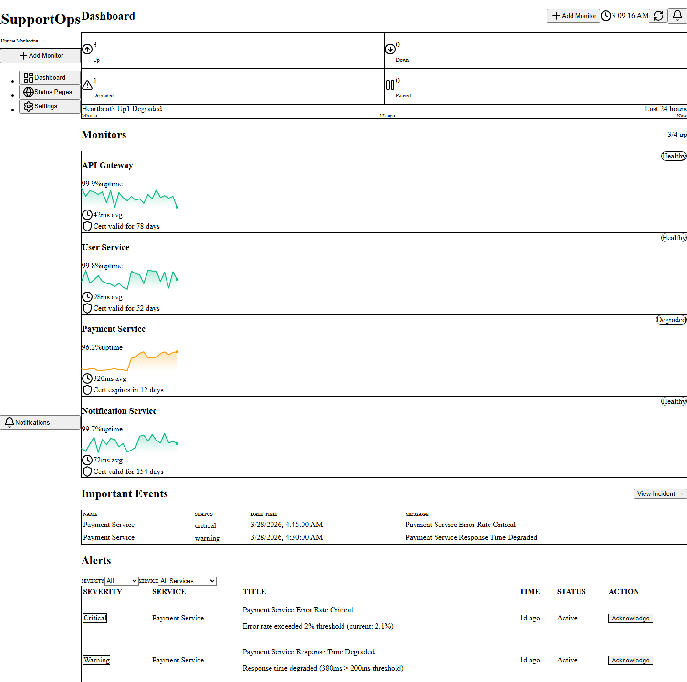
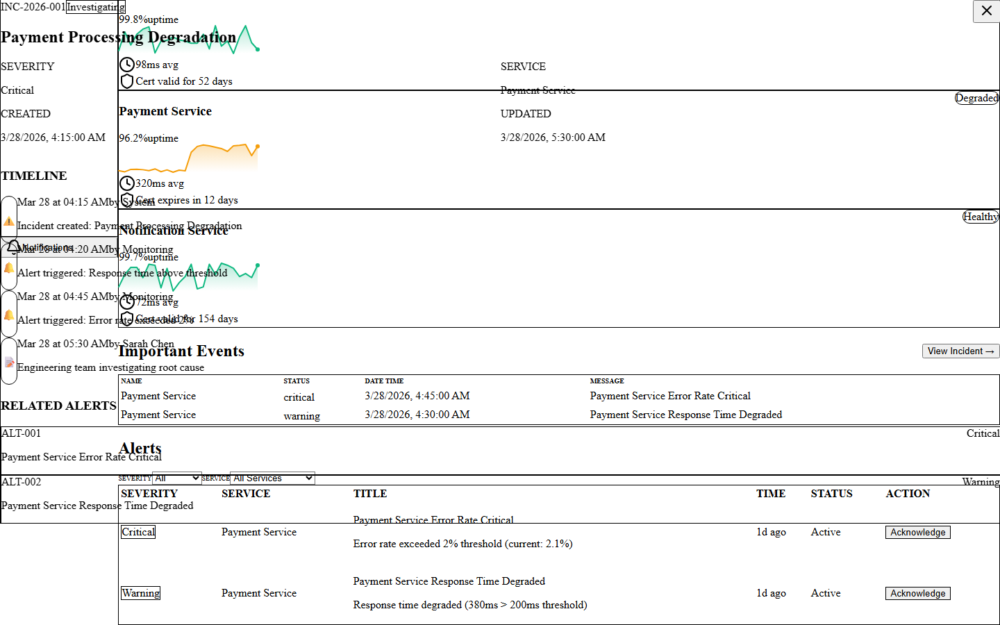

# SupportOps Monitoring Dashboard

A professional monitoring dashboard demonstrating operational awareness and system health monitoring capabilities. Built as a portfolio project to showcase Application Support and QA Automation skills.


## Case Study

### The Problem

Support teams using generic dashboards waste 30+ seconds per alert finding context. When a service degrades at 3 AM, the on-call engineer needs to know: *Which service? How bad? What's the timeline?* Generic dashboards show metrics but hide the narrative.

### The Approach

Built a domain-specific monitoring dashboard that surfaces the right information for triage decisions:

- **Heartbeat bars** — Instant visual pulse of service health over time, not just current state
- **Sparklines** — Response time trends at a glance, no need to click into graphs
- **Certificate expiry warnings** — Proactive alerts before SSL becomes an incident
- **Compact stats strip** — One-line summary: "3 Up · 0 Down · 1 Degraded" instead of four towering cards

### Key Design Decisions

| Decision | Why |
|----------|-----|
| Dark theme with emerald accent | NOC environments need low-eye-strain interfaces; green = healthy is universal |
| Split-panel incident view | Context stays visible while drilling into details — no navigation loss |
| Inline severity badges | Critical/Warning/Info at a glance without reading text |
| Hover states via CSS, not JS | Code review signal: engineering maturity, not junior patterns |

### What This Proves

I understand production monitoring workflows and build tools that reduce MTTR (Mean Time To Resolution). This isn't a generic dashboard — it's designed for the specific cognitive load of on-call triage.

---

## Screenshots

Current captures from the live remake are saved under `docs/screenshots/`.

| Dashboard Overview | Alert Table | Incident Panel |
|-------------------|-------------|----------------|
|  |  |  |

## Source inspiration disclosure

This portfolio rebuild is visually and structurally inspired by open-source monitoring platforms:

- **[Uptime Kuma](https://github.com/louislam/uptime-kuma)** — service health visualization, status page patterns, operational dashboard layout

This is an original React implementation for portfolio use. The goal is to study real support product patterns and recreate the feel of that workflow in a smaller standalone app. No source code was copied from those projects.

## Support relevance

This repo is meant to show work that maps directly to application support and production triage responsibilities.

| Support workflow | Relevance |
|------------------|-----------|
| Service health monitoring | Track system status and identify degraded services quickly |
| Alert triage | Prioritize alerts by severity and acknowledge investigation |
| Incident timeline review | Trace event sequences to understand failure progression |
| RCA documentation | Document root cause and resolution steps |
| Dashboard UX | Professional dark theme suitable for NOC environments |

## Overview

This dashboard simulates a real-world monitoring platform used by support teams to track service health, manage alerts, and coordinate incident response. It demonstrates key concepts in:

- **Service Health Monitoring** - Real-time status tracking with visual indicators
- **Alert Management** - Severity-based alerting with acknowledgment workflows
- **Incident Response** - Timeline visualization and drill-down investigation
- **Operational Metrics** - Uptime, latency, and error rate tracking

## Features

### Dashboard Overview
- **Service Health Cards** - Visual status indicators for 4 core services
- **Alert Table** - Active alerts with severity badges and timestamps
- **Stats Summary** - Quick overview of healthy services and critical alerts
- **Dark Theme** - Professional dark UI suitable for operations centers

### Service Monitoring
- **4 Services Tracked:**
  - API Gateway
  - User Service
  - Payment Service (degraded demo state)
  - Notification Service
- **Health States:** Healthy, Degraded, Down
- **Key Metrics:** Uptime %, P95 Latency, Error Rate

### Incident Management
- **Incident Panel** - Slide-over panel with full incident details
- **Timeline Visualization** - Chronological event tracking
- **Related Alerts** - Linked alerts for context
- **Status Tracking** - Open, Investigating, Identified, Resolved

### Demo Scenario
The dashboard includes a pre-configured "Payment Service Degradation" scenario:
- Payment Service showing degraded health (amber status)
- 2 active alerts (1 critical, 1 warning)
- Full incident timeline with 4 events
- RCA-ready for resolution workflow

## Tech stack

| Layer | Technology |
|-------|-----------|
| Framework | React 19 |
| Language | TypeScript 5.9 |
| Build | Vite 8 |
| Styling | Tailwind CSS 4 |
| Testing | Vitest + React Testing Library |
| Icons | Lucide React |

## Installation

```bash
# Clone the repository
git clone <your-repo-url>
cd supportops-monitoring-dashboard

# Install dependencies
npm install

# Start development server
npm run dev
```

## Run commands

```bash
npm install
npm run dev
npm test
npm run build
npm run preview
```

## Project Structure

```
src/
├── components/
│   ├── __tests__/
│   │   ├── AlertTable.test.tsx   # Alert rendering + severity tests
│   │   ├── HealthBadge.test.tsx  # Health state color tests
│   │   └── ServiceCard.test.tsx  # Service display + click tests
│   ├── ServiceCard.tsx      # Service health cards
│   ├── HealthBadge.tsx      # Status indicator badges
│   ├── MetricCard.tsx       # Metric display cards
│   ├── AlertTable.tsx       # Alerts list with acknowledgment
│   ├── IncidentPanel.tsx    # Incident detail panel
│   └── Timeline.tsx         # Incident timeline
├── data/
│   ├── services.ts          # Service definitions
│   ├── alerts.ts            # Alert data
│   └── incidents.ts         # Incident scenarios
├── test/
│   └── setup.ts             # Test configuration
├── types/
│   └── monitoring.ts        # TypeScript interfaces
└── App.tsx                  # Main dashboard layout
```

## Key Concepts Demonstrated

### Operational Awareness
- Understanding of service dependencies and health indicators
- Alert severity classification and response prioritization
- Incident lifecycle management (detection → investigation → resolution)

### Frontend Engineering
- Component-based architecture with React
- Type-safe development with TypeScript
- Responsive design with Tailwind CSS
- State management with React hooks

### Support Engineering Skills
- Monitoring dashboard UX patterns
- Alert fatigue mitigation through clear visual hierarchy
- Incident communication and timeline tracking

## Troubleshooting Guide

### Payment Service Degradation Scenario

**Symptom:** Payment Service shows degraded health (amber badge), with 2 active alerts

**Investigation Steps:**

1. **Check the dashboard overview** — the Stats bar shows 1 degraded service and active critical alerts
2. **Review the alert table** — filter by `critical` severity to isolate the most urgent alert (ALT-001: Error Rate Critical)
3. **Acknowledge alerts** — click the "Acknowledge" button on active alerts to signal you're investigating
4. **Open the incident panel** — click the Payment Service card or "View Incident →" to see the full timeline
5. **Trace the timeline** — events show the degradation sequence:
   - 09:15 — Incident created by system
   - 09:20 — Response time alert triggered
   - 09:45 — Error rate exceeded 2% threshold
   - 10:30 — Engineering team investigating root cause

**Root Cause:** Connection pool exhaustion in the Payment Service caused by a surge in transaction volume. The service's connection pool (max 50 connections) was saturated, causing new requests to queue and eventually timeout.

**Resolution:**
1. Scale the connection pool from 50 → 200 connections
2. Add circuit breaker pattern to prevent cascade failures
3. Deploy connection pool monitoring alert at 80% utilization

**Prevention:**
- Set up capacity alerts at 70% and 85% thresholds
- Implement auto-scaling for connection pools during peak traffic
- Add runbook automation for pool exhaustion events

---

### Using Alert Filters

The dashboard provides severity and service filters above the alert table:

- **Severity filter:** Show only Critical, Warning, or Info alerts
- **Service filter:** Isolate alerts for a specific service
- **Clear filters:** Click "Clear filters" to reset both

This mirrors real-world NOC workflows where operators triage by severity first, then drill into specific services.

---

### Refreshing Dashboard Data

- The header shows a **live clock** and a **refresh indicator** showing seconds since last data refresh
- Click the **refresh button** (↻) to manually trigger a data refresh
- In production, this would connect to a metrics backend; here it demonstrates the UX pattern

## What This Demonstrates for Application Support + QA Automation

This project demonstrates key competencies for support engineering roles:

### Operational Awareness
- Understanding of monitoring/alerting workflows
- Service health visualization and status communication
- Incident lifecycle management (detection → resolution)
- Alert severity classification and response prioritization

### Technical Skills
- React + TypeScript frontend development
- Component-based architecture with proper typing
- Test-driven development (Vitest + React Testing Library)
- CI/CD awareness (GitHub Actions)

### Support Engineering Mindset
- Clear incident communication and documentation
- Root cause analysis (RCA) methodology
- Runbook/troubleshooting guide creation
- SLA awareness and deadline tracking

### Portfolio Value
This is an original inspired rebuild, not a direct clone. It demonstrates understanding of support operations without requiring production infrastructure.

## Inspiration

This project was inspired by [Uptime Kuma](https://github.com/louislam/uptime-kuma), an open-source monitoring platform. It is an original rebuild for portfolio demonstration purposes, not a direct clone.

## License

MIT

---

**Built for Portfolio** | React + TypeScript + Vite + Tailwind CSS
